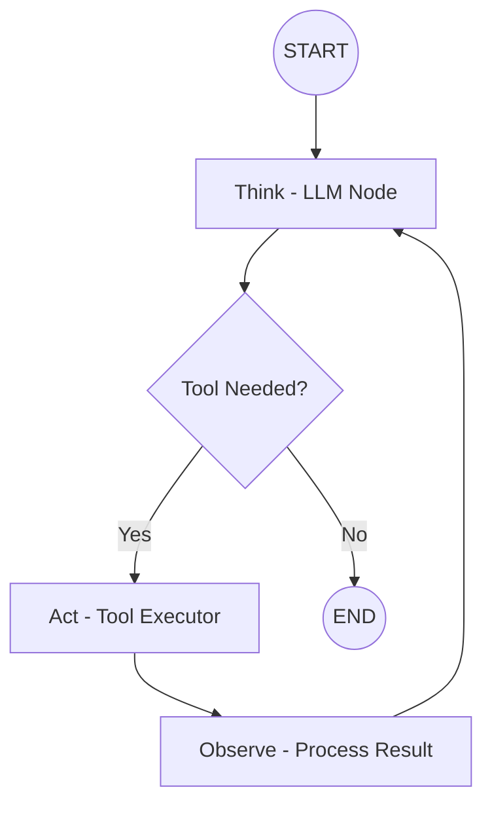

# Create Arquitecture

Analisa documentos em `docs/` e cria `ARQUITECTURE.md` completo com estrutura LangGraph, diagrama de fluxo, state schema e arquitetura de dados.

## 🎯 Objetivo

Gerar documentação técnica de arquitetura que define:

- ✅ Expectativa de Nodes criados (quantidade, responsabilidades)
- ✅ Fluxo entre Nodes (edges, conditional routing)
- ✅ Arquitetura de dados do banco de dados (se aplicável)
- ✅ Diagrama de fluxo visual (Mermaid)
- ✅ Estrutura do State esperado (TypedDict, reducers)
- ✅ Padrões LangGraph aplicados (ReAct, Supervisor, Multi-Agent)

## 🔧 Instruções

### 1. **Buscar Conhecimento Especializado**

1.1 **Invocar Skills Relevantes**

- Usar `Skill(skill="agentc-ai-developer:langgraph-arquitecture")` para padrões LangGraph
- Extrair conceitos fundamentais: StateGraph, nodes, edges, agentic loop
- Identificar padrões aplicáveis ao projeto

1.2 **Pesquisar Melhores Práticas (se necessário)**

- Se skills insuficientes: usar `WebSearch` para buscar padrões LangGraph 1.0
- Focar em: arquitectures similares, state management patterns, node design
- Queries úteis:
  - "LangGraph 1.0 architecture patterns"
  - "LangGraph state design best practices"
  - "LangGraph multi-agent architecture"

### 2. **Analisar Documentos do Projeto**

2.1 **Descobrir Documentos em docs/**

- Usar `Glob(pattern="docs/**/*.md")` para encontrar todos arquivos
- Listar arquivos encontrados para o usuário
- Priorizar: README.md, PRD.md, SPECS.md, USER_STORIES.md, REQUIREMENTS.md

2.2 **Ler Documentos Relevantes**

- Usar `Read` para cada arquivo encontrado
- Extrair informações:
  - **Requisitos funcionais**: O que o sistema deve fazer
  - **User stories**: Fluxos de interação esperados
  - **Entidades de dados**: Modelos, schemas, relacionamentos
  - **Integrações**: APIs, tools, serviços externos
  - **Casos de uso**: Cenários de execução

2.3 **Identificar Patterns de Arquitetura**

- Determinar se é:
  - Simple Agent (linear flow)
  - ReAct Agent (tool-calling loop)
  - Multi-Agent System (supervisor pattern)
  - Human-in-the-Loop (interrupt/approval)
- Mapear requisitos para nodes LangGraph

### 3. **Sintetizar Arquitetura**

3.1 **Definir Nodes Esperados**

Para cada node:

- **Nome**: Identificador único (kebab-case)
- **Responsabilidade**: O que processa (1 frase)
- **Input**: Keys do state que lê
- **Output**: Keys do state que atualiza
- **Tipo**: LLM node, tool executor, validator, formatter, etc

Exemplo:

```markdown
### Node: `think`
- **Responsabilidade**: Raciocina sobre state atual e decide próxima ação
- **Input**: `messages`, `context`
- **Output**: `messages`, `next_action`
- **Tipo**: LLM node
```

3.2 **Definir Fluxo entre Nodes**

Para cada edge:

- **Source → Target**: De qual node para qual
- **Tipo**: Direct edge ou Conditional edge
- **Condição**: Se conditional, descrever lógica de routing
- **Ciclos**: Identificar loops (agentic loops)

Exemplo:

```markdown
### Flow
1. `START → think` (direct)
2. `think → decide` (conditional: se tool_needed → `act`, senão → `END`)
3. `act → observe` (direct)
4. `observe → think` (direct - loop back)
```

3.3 **Definir State Schema**

- Listar todas keys do state
- Especificar type hints (str, int, List[str], etc)
- Identificar reducers necessários (add_messages, operator.add, etc)
- Documentar propósito de cada field

Exemplo:

```python
class AgentState(TypedDict):
    messages: Annotated[list, add_messages]  # Histórico de mensagens
    context: str  # Contexto extraído de docs
    tools_used: Annotated[List[str], operator.add]  # Tools invocadas
    final_output: str  # Resposta final
```

3.4 **Definir Arquitetura de Dados**

Se o projeto usa banco de dados ou persistence:

- **Checkpointer**: MemorySaver, SQLite, PostgreSQL
- **Schema de persistence**: Tables, collections, keys
- **Relacionamentos**: Entre entidades persistidas
- **Índices**: Para otimização de queries

Se NÃO usa persistence:

- Documentar: "Não usa banco de dados. State é transiente."

### 4. **Criar Diagrama de Fluxo (Mermaid)**

4.1 **Gerar Diagrama Visual**

Usar sintaxe Mermaid para representar:

- Nodes como caixas retangulares
- Edges como setas
- Conditional routing como losangos
- START/END como círculos

Exemplo:



### 5. **Estruturar e Escrever ARQUITECTURE.md**

5.1 **Seções Obrigatórias**

````markdown
# Arquitecture - [Nome do Projeto]

[Breve descrição do sistema - 2-3 linhas]

## 📋 Overview

[Resumo da arquitetura: pattern usado, complexidade, principais componentes]

## 🏗️ Nodes Esperados

[Lista detalhada de cada node conforme 3.1]

## 🔄 Fluxo entre Nodes

[Descrição do fluxo conforme 3.2]

## 📊 Diagrama de Fluxo

[Diagrama Mermaid conforme 4.1]

## 🗃️ State Schema

[State TypedDict completo conforme 3.3]

```python
# Código Python do State
````

## 💾 Arquitetura de Dados

[Se aplicável: persistence, checkpointer, schema]
[Se não aplicável: "Não usa banco de dados. State é transiente."]

## 🎯 Padrões LangGraph Aplicados

[Lista de patterns: ReAct, Supervisor, Multi-Agent, HITL, etc]

## ✅ Validação de Arquitetura

- [ ] State schema cobre todos dados necessários
- [ ] Nodes têm responsabilidades únicas
- [ ] Edges definem fluxo completo (sem dead ends)
- [ ] Agentic loop implementado se necessário
- [ ] Persistence configurada se necessário
- [ ] Pattern escolhido alinha com requisitos

````

5.2 **Escrever Arquivo**

- Usar `Write(file_path="ARQUITECTURE.md", content=...)`
- Incluir todas seções obrigatórias
- Garantir formatação Markdown válida
- Adicionar exemplos de código onde apropriado

### 6. **Validar Arquitetura Criada**

6.1 **Checklist de Completude**

- [ ] Todos nodes documentados com responsabilidades claras
- [ ] Fluxo completo (START → ... → END) definido
- [ ] State schema inclui todos fields necessários
- [ ] Reducers identificados para fields acumulados
- [ ] Diagrama Mermaid renderiza corretamente
- [ ] Persistence definida ou explicitamente descartada
- [ ] Padrões LangGraph aplicados identificados

6.2 **Apresentar Resumo**

Mostrar ao usuário:
```text
✅ ARQUITECTURE.md criado com sucesso!

📊 Resumo da Arquitetura:
- Nodes: [X nodes]
- Edges: [Y edges (X direct, Y conditional)]
- State fields: [Z fields]
- Pattern: [Nome do pattern]
- Persistence: [Sim/Não]

📁 Arquivo criado: ARQUITECTURE.md
````

## 📊 Formato de Saída

### Arquivo ARQUITECTURE.md

Documento completo com todas as seções obrigatórias conforme 5.1.

### Mensagem de Confirmação

```text
✅ ARQUITECTURE.md criado com sucesso!

📊 Resumo da Arquitetura:
- Nodes: 5 nodes (think, decide, act, observe, format)
- Edges: 6 edges (4 direct, 2 conditional)
- State fields: 4 fields (messages, context, tools_used, final_output)
- Pattern: ReAct Agent com Agentic Loop
- Persistence: Sim (MemorySaver checkpointer)

📁 Arquivo: ARQUITECTURE.md (250 linhas)

📋 Próximos passos sugeridos:
1. Revisar state schema para garantir completude
2. Validar nodes mapeiam todos requisitos
3. Implementar spike técnico seguindo arquitecture
```

## ✅ Critérios de Sucesso

- [ ] Skills LangGraph consultadas antes de criar
- [ ] Todos arquivos em `docs/` descobertos e lidos
- [ ] Requisitos funcionais extraídos corretamente
- [ ] Nodes definidos com responsabilidades únicas
- [ ] Fluxo completo (START → END) documentado
- [ ] State schema TypedDict completo e tipado
- [ ] Reducers identificados para acumulação
- [ ] Diagrama Mermaid válido e renderizável
- [ ] Persistence definida ou explicitamente descartada
- [ ] Padrões LangGraph aplicados identificados
- [ ] ARQUITECTURE.md criado com todas seções
- [ ] Validação de completude executada
- [ ] Resumo apresentado ao usuário
- [ ] Arquivo tem < 400 linhas (conciso)
- [ ] Código Python do State é executável

## 📝 Exemplos

### Exemplo 1 - Projeto simples sem docs/

```bash
/create-arquitecture
```

**Comportamento:**

1. Glob encontra 0 arquivos em `docs/`
1. Pergunta ao usuário: "Não encontrei docs/. Descreva brevemente o projeto:"
1. Usuário fornece descrição manual
1. Cria ARQUITECTURE.md baseado em descrição

### Exemplo 2 - Projeto com docs/ completo

```bash
/create-arquitecture
```

**Comportamento:**

1. Glob encontra: `docs/PRD.md`, `docs/USER_STORIES.md`, `docs/API_SPECS.md`
1. Lê todos arquivos
1. Extrai requisitos: "Sistema de RAG com busca vetorial e geração de resposta"
1. Define:
   - 6 nodes: ingest, embed, search, rank, generate, format
   - ReAct pattern com tool calling
   - State: messages, documents, embeddings, final_answer
1. Cria ARQUITECTURE.md completo (320 linhas)

### Exemplo 3 - Projeto com custom path

```bash
/create-arquitecture /path/to/my-project
```

**Comportamento:**

1. Busca docs em `/path/to/my-project/docs/`
1. Cria `/path/to/my-project/ARQUITECTURE.md`

## ❌ Anti-Patterns

### ❌ Erro 1: Ignorar Skills Especializadas

Não criar arquitetura sem consultar conhecimento LangGraph:

```bash
# ❌ Errado - Pular Passo 1
Criar ARQUITECTURE.md direto sem skills

# ✅ Correto - Sempre invocar skills primeiro
Skill(skill="agentc-ai-developer:langgraph-arquitecture")
```

### ❌ Erro 2: State Schema Incompleto

Não omitir fields necessários do state:

```python
# ❌ Errado - Falta context, tools_used
class AgentState(TypedDict):
    messages: list

# ✅ Correto - Todos fields necessários
class AgentState(TypedDict):
    messages: Annotated[list, add_messages]
    context: str
    tools_used: Annotated[List[str], operator.add]
    final_output: str
```

### ❌ Erro 3: Fluxo sem START/END

Não criar fluxo incompleto:

```markdown
# ❌ Errado - Falta START e END
think → act → observe

# ✅ Correto - Fluxo completo
START → think → decide → act → observe → think → END
```

### ❌ Erro 4: Diagrama Mermaid Inválido

Não usar sintaxe Mermaid incorreta:

```mermaid
# ❌ Errado - Sintaxe inválida
think -> act -> observe

# ✅ Correto - Sintaxe Mermaid válida
graph TD
    think[Think] --> act[Act]
    act --> observe[Observe]
```

### ❌ Erro 5: Não Especificar Persistence

Não deixar ambíguo se usa banco de dados:

```markdown
# ❌ Errado - Não menciona persistence
## 💾 Arquitetura de Dados
[vazio]

# ✅ Correto - Explícito
## 💾 Arquitetura de Dados
Não usa banco de dados. State é transiente em cada invocação.

# ✅ Correto - Com persistence
## 💾 Arquitetura de Dados
**Checkpointer**: MemorySaver (in-memory)
**Schema**: Salva state completo após cada super-step
**Thread ID**: Necessário para multi-thread execution
```
