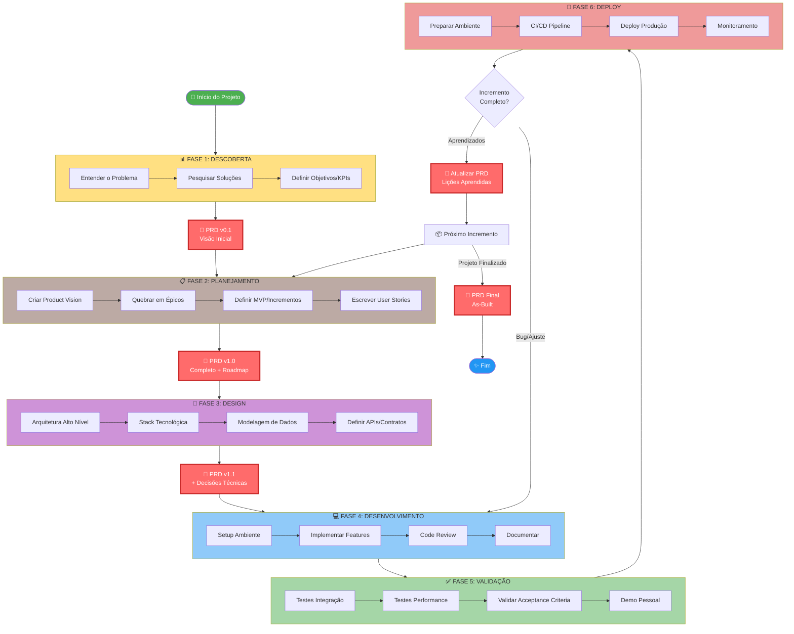

# Incremental Development Plugin

Plugin para orientar desenvolvimento iterativo/incremental seguindo os princípios **YAGNI** (You Aren't Gonna Need It) e **Evolutionary Architecture**. Evita over-engineering e promove simplicidade através de coaching inteligente e detecção automática de complexidade desnecessária.

## 🎯 Objetivo

Este plugin **NÃO implementa código automaticamente** - ele atua como um **coach** que:
- ✅ Questiona funcionalidades antecipadas
- ✅ Sugere MVPs mínimos
- ✅ Detecta over-engineering automaticamente
- ✅ Identifica momento certo de refatorar
- ✅ Previne abstrações prematuras
- ❌ Não toma decisões sem aprovação do usuário

## 📦 Instalação

```bash
/plugin marketplace add cadugevaerd/claudecode_plugins
/plugin install incremental-dev
```

## 🧠 Conceitos Fundamentais

### 1. YAGNI (You Aren't Gonna Need It)

**Princípio**: Não adicione funcionalidades até que sejam REALMENTE necessárias.

❌ **Errado**:
```python
# Adicionando "para o futuro"
def process_email(email, retry=3, timeout=30, async_mode=False):
    send(email)  # retry, timeout, async_mode não usados!
```

✅ **Correto**:
```python
# Apenas o necessário AGORA
def process_email(email):
    send(email)
# Adicionar retry/timeout QUANDO necessário
```

### 2. Evolutionary Architecture

**Princípio**: Arquitetura evolui conforme requisitos surgem, não é planejada antecipadamente.

❌ **Errado (over-engineering)**:
```python
# MVP com abstração complexa
class AbstractProcessor(ABC):
    @abstractmethod
    def process(self): pass

class EmailProcessor(AbstractProcessor):  # Única implementação!
    def process(self): ...
```

✅ **Correto (evolutionary)**:
```python
# Iteração 1: Função simples
def process_email(email):
    ...

# Iteração 5: Agora temos 3 processadores - HORA de abstrair
class Processor:
    def process(self): ...

class EmailProcessor(Processor): ...
class SMSProcessor(Processor): ...
class PushProcessor(Processor): ...
```

### 3. Regra dos 3

**Princípio**: Refatore quando padrão aparecer 3+ vezes, não antes.

```
1 ocorrência  → Código direto
2 ocorrências → Duas funções (duplicação OK!)
3+ ocorrências → REFATORAR (padrão confirmado)
```

### 4. Incremental Development

**Princípio**: Adicionar uma funcionalidade por vez, testar, depois próxima.

✅ **Workflow correto**:
```
Iteração 1: MVP (processa email básico)
    ↓ testar
Iteração 2: Adiciona validação
    ↓ testar
Iteração 3: Adiciona retry
    ↓ testar
Iteração 4: Refatora (padrões emergiram)
```

## 📋 Comandos Disponíveis

### `/setup-project-incremental`

**Configura CLAUDE.md do projeto** com instruções de desenvolvimento incremental.

```bash
/setup-project-incremental
```

Ou com contexto do projeto:

```bash
/setup-project-incremental "API REST com LangGraph para processamento de documentos"
```

**O que faz**:
- ✅ Cria ou atualiza `CLAUDE.md` na raiz do projeto
- ✅ Adiciona instruções completas de YAGNI e Evolutionary Architecture
- ✅ Orienta Claude a sempre começar com MVP
- ✅ Documenta comandos do plugin
- ✅ Preserva conteúdo existente (não sobrescreve)

**Quando usar**:
- Início de novo projeto
- Projeto existente que quer adotar desenvolvimento incremental
- Documentar workflow incremental para equipe

**Resultado**:
Claude ficará automaticamente orientado a:
- Questionar funcionalidades prematuras
- Sugerir MVPs mínimos
- Evitar over-engineering
- Refatorar no momento certo

### `/start-incremental`

Inicia desenvolvimento incremental definindo MVP mínimo.

**Uso**:
```
/start-incremental "Criar sistema de processamento de emails"
```

**O que faz**:
1. Questiona objetivo real
2. Define MVP (3-5 funcionalidades essenciais)
3. Lista explicitamente o que NÃO fazer (YAGNI)
4. Sugere código mais simples possível

**Exemplo de output**:
```
📦 DESENVOLVIMENTO INCREMENTAL - MVP

Objetivo: Sistema de processamento de emails

🎯 MVP (Iteração 1):
- [ ] Receber email (string)
- [ ] Processar (função process_email simples)
- [ ] Retornar "processado" ou "erro"

❌ NÃO FAZER AGORA (YAGNI):
- Sistema de filas (RabbitMQ, Celery)
- Validação complexa de email
- Múltiplos processadores
- Logging estruturado
- Rate limiting
- Retry automático
- Métricas e monitoramento

💡 Código MVP:
def process_email(email: str) -> str:
    if not email:
        return "erro"
    # Lógica mínima aqui
    return "processado"

Implementar este MVP? (s/n)
```

---

### `/add-increment`

Adiciona próxima funcionalidade de forma MÍNIMA e INCREMENTAL.

**Uso**:
```
/add-increment "Adicionar validação de email"
```

**O que faz**:
1. Analisa estado atual do código
2. Define incremento MÍNIMO necessário
3. Questiona necessidade real
4. Lista o que NÃO adicionar (YAGNI)
5. Sugere implementação mais simples

**Exemplo de output**:
```
🔄 ADICIONAR INCREMENTO

📍 Estado Atual:
- MVP funciona: processa emails
- Arquivo principal: email_processor.py

📝 Novo Requisito: Validação de email

✅ INCREMENTO MÍNIMO:

def validate_email(email: str) -> bool:
    return "@" in email  # Validação mínima!

def process_email(email: str):
    if not validate_email(email):
        return "erro: email inválido"
    # resto do processamento...

❌ NÃO ADICIONAR AGORA:
- Regex complexo de validação
- Verificar domínio DNS
- Múltiplos tipos de validação
- Classe EmailValidator
- Sistema de erros customizados

💡 Validação mínima funciona. Adicionar complexidade APENAS quando necessário.

Implementar? (s/n)
```

---

### `/refactor-now`

Identifica momento apropriado para refatorar (quando padrões emergem).

**Uso**:
```
/refactor-now
```

**O que faz**:
1. Escaneia código em busca de padrões
2. Aplica "Regra dos 3" (3+ ocorrências)
3. Valida se padrão é real ou coincidência
4. Sugere refatoração apenas se vale a pena
5. Bloqueia refatoração prematura

**Exemplo de output (refatorar)**:
```
🔄 ANÁLISE DE REFATORAÇÃO

✅ PADRÃO EMERGENTE DETECTADO

Padrão: Validação de email duplicada
Ocorrências: 3x (CONFIRMADO!)

Locais:
├─ email_processor.py linha 45
├─ sms_processor.py linha 78
└─ notification.py linha 123

💡 Momento CERTO: Padrão confirmado (3+)

━━━━━━━━━━━━━━━━━━━━━━━━━━━━━━━━━━━━━━━━━
REFATORAÇÃO: Extrair validate_email para utils
━━━━━━━━━━━━━━━━━━━━━━━━━━━━━━━━━━━━━━━━━

Antes (3 lugares):
if "@" not in email:
    raise ValueError("Invalid email")

Depois (1 lugar):
# utils/validators.py (NOVO)
def validate_email(email: str) -> bool:
    return "@" in email

Impacto:
✅ Elimina duplicação (3 lugares → 1)
✅ Mudanças futuras em 1 lugar apenas
✅ Mais testável

Refatorar? (s/n)
```

**Exemplo de output (NÃO refatorar)**:
```
🔄 ANÁLISE DE REFATORAÇÃO

❌ REFATORAÇÃO NÃO RECOMENDADA

Padrão: Função similar em 2 lugares (APENAS 2)

💡 Regra dos 3 NÃO satisfeita:
- Apenas 2 ocorrências
- Pode ser coincidência
- Padrão não confirmado

✅ RECOMENDAÇÃO:
Continuar desenvolvendo. Refatorar quando:
- Padrão aparecer 3+ vezes
- Duplicação dificultar manutenção

Continue com /add-increment
```

---

### `/review-yagni`

Revisa código identificando e removendo over-engineering.

**Uso**:
```
/review-yagni
```

**O que faz**:
1. Escaneia codebase inteira
2. Detecta abstrações prematuras
3. Identifica código não utilizado
4. Encontra configurações excessivas
5. Sugere simplificações concretas

**Exemplo de output**:
```
⚠️  REVISÃO YAGNI - OVER-ENGINEERING DETECTADO

━━━━━━━━━━━━━━━━━━━━━━━━━━━━━━━━━━━━━━━━━
1. ⚠️  Abstração Prematura
━━━━━━━━━━━━━━━━━━━━━━━━━━━━━━━━━━━━━━━━━

Arquivo: processors/base.py
Problema: AbstractProcessorFactory usado apenas 1 vez

Código atual (15 linhas):
class AbstractProcessorFactory:
    def create_processor(self, type):
        if type == "email":
            return EmailProcessor()

processor = factory.create_processor("email")

Simplificação (1 linha):
processor = EmailProcessor()  # Direto!

Impacto:
✅ Remove arquivo base.py (15 linhas)
✅ Código mais direto
✅ Sem complexidade desnecessária

Simplificar? (s/n)

━━━━━━━━━━━━━━━━━━━━━━━━━━━━━━━━━━━━━━━━━
2. ⚠️  Configuração Excessiva
━━━━━━━━━━━━━━━━━━━━━━━━━━━━━━━━━━━━━━━━━

Arquivo: config/manager.py
Problema: 200 linhas para gerenciar 2 configurações

Código atual (200 linhas):
class ConfigurationManager:
    # ... 200 linhas ...

Simplificação (3 linhas):
CONFIG = {
    "max_retries": 3,
    "timeout": 30
}

Impacto:
✅ Remove arquivo manager.py (200 linhas!)
✅ Config clara e simples

Simplificar? (s/n)
```

## 🤖 Agente: incremental-dev-coach

Agente especializado em orientar (não implementar) desenvolvimento incremental.

**Uso**:
```
/task "usar incremental-dev-coach para definir MVP de sistema de pagamentos"
```

**Responsabilidades**:
- Questionar funcionalidades antecipadas
- Definir MVPs mínimos
- Detectar over-engineering
- Orientar incrementos
- Identificar momento de refatorar

**Exemplo de interação**:
```
User: "Quero criar sistema de pagamentos com múltiplos gateways,
retry, webhooks, logging e métricas"

incremental-dev-coach:
━━━━━━━━━━━━━━━━━━━━━━━━━━━━━━━━━━━━━━━━━

🤔 QUESTIONAMENTO YAGNI

Você mencionou MUITAS funcionalidades.

❓ Perguntas essenciais:
1. Qual problema REAL precisa resolver AGORA?
2. Quantos gateways usará inicialmente? (provavelmente 1)
3. Já teve problemas de falha que exigem retry?
4. Já tem usuários para métricas?

💡 Recomendação: MVP MÍNIMO

📦 MVP SUGERIDO:
- [ ] Processar pagamento com 1 gateway (Stripe)
- [ ] Retornar sucesso/erro

Apenas isso! Sem:
- ❌ Múltiplos gateways (adicionar quando necessário)
- ❌ Retry (adicionar se falhar)
- ❌ Webhooks (adicionar quando precisar)
- ❌ Logging (print() serve por enquanto)
- ❌ Métricas (adicionar quando tiver usuários)

Este MVP resolve o problema inicial? (s/n)
```

## 🎨 Skills (Auto-Invocadas)

### yagni-enforcer

**Detecta automaticamente** quando Claude está prestes a criar over-engineering.

**Auto-invocado quando**:
- Criar classes abstratas
- Implementar design patterns
- Adicionar configuração complexa
- Antecipar funcionalidades futuras
- Usar frases como "para o futuro"

**Exemplo de detecção automática**:
```
Claude: "Vou criar AbstractProcessorFactory para facilitar..."

yagni-enforcer (ATIVADO AUTOMATICAMENTE):
━━━━━━━━━━━━━━━━━━━━━━━━━━━━━━━━━━━━━━━━━

⚠️  YAGNI VIOLATION DETECTADA

Tipo: Abstração Prematura
Severidade: 🟡 MODERADO

❌ Problema:
- AbstractProcessorFactory para 1 produto = over-engineering
- Você está antecipando futuro
- Adiciona complexidade sem benefício AGORA

✅ Alternativa YAGNI:
processor = EmailProcessor()  # Direto!

💡 Regra: Factory com 3+ produtos, não com 1

Usar código simples? (s/n)
```

---

### refactor-advisor

**Detecta automaticamente** quando padrões emergiram e sugere refatoração apropriada.

**Auto-invocado quando**:
- Código tem duplicação
- Após adicionar incrementos
- Classes com estrutura similar
- Mudança exige múltiplos arquivos

**Exemplo de detecção automática**:
```
Claude: Acabei de adicionar terceiro processador similar

refactor-advisor (ATIVADO AUTOMATICAMENTE):
━━━━━━━━━━━━━━━━━━━━━━━━━━━━━━━━━━━━━━━━━

✅ PADRÃO EMERGIU - MOMENTO DE REFATORAR

Tipo: Template Method
Ocorrências: 3 classes

💡 Estrutura IDÊNTICA em 3 classes = padrão confirmado!

✅ SUGESTÃO DE REFATORAÇÃO:
Criar classe base Processor com métodos validate/process/cleanup

Impacto:
✅ Elimina duplicação (3 classes)
✅ Facilita adicionar novos processadores

Refatorar agora? (s/n)
```

## 📚 Exemplos Práticos Completos

### Exemplo 1: API REST com LangGraph (Desenvolvimento Incremental)

#### Iteração 1: MVP

```python
from fastapi import FastAPI
from langgraph.graph import StateGraph

app = FastAPI()

def process_node(state):
    return {"result": "processed"}

graph = StateGraph(dict)
graph.add_node("process", process_node)
graph.set_entry_point("process")
graph.set_finish_point("process")
app_graph = graph.compile()

@app.post("/process")
def process_doc(text: str):
    result = app_graph.invoke({"text": text})
    return result

# ✅ MVP funciona! Testar antes de continuar
```

#### Iteração 2: Adicionar Validação (quando usuário enviar dados ruins)

```python
from pydantic import BaseModel

class ProcessRequest(BaseModel):
    text: str

@app.post("/process")
def process_doc(req: ProcessRequest):
    if not req.text:
        return {"error": "text required"}
    result = app_graph.invoke({"text": req.text})
    return result

# ✅ Funciona! Testar antes de continuar
```

#### Iteração 3: Adicionar Retry (quando erro ocorrer)

```python
def process_node(state):
    try:
        result = do_processing(state)
        return {"result": result}
    except Exception as e:
        # Retry UMA vez (simples!)
        try:
            result = do_processing(state)
            return {"result": result}
        except:
            return {"result": "erro", "error": str(e)}

# ✅ Funciona! Testar antes de continuar
```

#### Iteração 4: Refatorar (quando padrão emergir)

```python
# APENAS quando tiver 3+ nodes com retry
# Criar função with_retry:

def with_retry(func, state, retries=1):
    for attempt in range(retries + 1):
        try:
            return func(state)
        except Exception as e:
            if attempt == retries:
                return {"error": str(e)}

def process_node(state):
    return with_retry(do_processing, state, retries=1)
```

---

### Exemplo 2: Sistema de Processamento de Emails

#### Iteração 1: MVP

```python
def process_email(email: str) -> str:
    if not email:
        return "erro"
    # Lógica mínima
    send_to_external_api(email)
    return "processado"

# ✅ Funciona! Testar
```

#### Iteração 2: Adicionar Validação

```python
def validate_email(email: str) -> bool:
    return "@" in email  # Simples!

def process_email(email: str) -> str:
    if not validate_email(email):
        return "erro: email inválido"
    send_to_external_api(email)
    return "processado"

# ✅ Funciona! Testar
```

#### Iteração 3: Adicionar Logging

```python
def process_email(email: str) -> str:
    print(f"Processing: {email}")  # Log simples!
    if not validate_email(email):
        print("Validation failed")
        return "erro: email inválido"
    send_to_external_api(email)
    print("Success")
    return "processado"

# ✅ Funciona! print() é suficiente por enquanto
```

#### Iteração 5: Refatorar Logging (quando necessário)

```python
import logging

logger = logging.getLogger(__name__)

def process_email(email: str) -> str:
    logger.info(f"Processing: {email}")
    if not validate_email(email):
        logger.warning("Validation failed")
        return "erro: email inválido"
    send_to_external_api(email)
    logger.info("Success")
    return "processado"

# APENAS quando print() não for mais suficiente
```

---

### Exemplo 3: Quando NÃO Fazer (YAGNI Violations)

#### ❌ ERRADO: Factory Prematura

```python
# NÃO FAZER no MVP!
class AbstractProcessorFactory:
    def create_processor(self, type):
        if type == "email":
            return EmailProcessor()

factory = AbstractProcessorFactory()
processor = factory.create_processor("email")
```

#### ✅ CORRETO: Criação Direta

```python
# MVP correto
processor = EmailProcessor()  # Simples e direto!

# Criar factory APENAS quando tiver 3+ tipos
```

---

#### ❌ ERRADO: Configuração Complexa

```python
# NÃO FAZER no MVP!
class ConfigurationManager:
    def __init__(self):
        self.config = {}

    def load_from_yaml(self, path):
        # 50 linhas carregando YAML

    def validate_schema(self):
        # 30 linhas validando

config = ConfigurationManager()
config.load_from_yaml("config.yaml")
MAX_RETRIES = config.get("max_retries")
```

#### ✅ CORRETO: Constantes Simples

```python
# MVP correto
MAX_RETRIES = 3
TIMEOUT = 30

# Criar ConfigManager APENAS quando tiver 10+ configs
```

---

#### ❌ ERRADO: Abstração Prematura

```python
# NÃO FAZER no MVP!
class AbstractProcessor(ABC):
    @abstractmethod
    def process(self): pass

class EmailProcessor(AbstractProcessor):  # Única implementação!
    def process(self): ...
```

#### ✅ CORRETO: Função Direta

```python
# MVP correto
def process_email(email):
    ...

# Criar abstração APENAS quando tiver 3+ processadores
```

## 🎯 Workflow Recomendado

### 1. Iniciar Projeto

```bash
/start-incremental "Sistema de notificações"
```

→ Define MVP mínimo
→ Lista o que NÃO fazer
→ Foco no essencial

### 2. Implementar MVP

Implementar apenas funcionalidades definidas.

### 3. Testar MVP

Garantir que funciona antes de continuar.

### 4. Adicionar Incremento

```bash
/add-increment "Adicionar validação"
```

→ Implementa mínimo necessário
→ Testa novamente

### 5. Repetir Incrementos

Continue ciclo de adicionar → testar → próximo.

### 6. Refatorar Quando Padrões Emergirem

```bash
/refactor-now
```

→ Detecta padrões (3+ vezes)
→ Refatora se vale a pena

### 7. Revisar Over-Engineering

```bash
/review-yagni
```

→ Identifica complexidade desnecessária
→ Simplifica código

---

## 📄 Gerenciamento de PRD (Product Requirements Document)

Este plugin inclui gerenciamento completo de PRD - um **documento vivo** que evolui junto com o projeto.

### 🎯 O Que é PRD?

**PRD (Product Requirements Document)** é a documentação central do projeto que registra:
- Problema que o projeto resolve
- Objetivos e KPIs
- MVP e roadmap de incrementos
- Decisões arquiteturais (ADRs)
- Aprendizados de cada incremento
- Timeline de evolução

### 🔄 Fases do PRD

O PRD evolui em fases conforme projeto avança:



### 📦 Comandos de PRD

#### `/setup-project-incremental`
Cria PRD v0.1 inicial junto com CLAUDE.md

```bash
/setup-project-incremental "Sistema de processamento de documentos"
```

**Cria**:
- `CLAUDE.md` - Instruções de desenvolvimento incremental
- `docs/PRD.md v0.1` - Problema, objetivos, KPIs

---

#### `/prd-update [fase]`
Atualiza PRD conforme fase do projeto

```bash
# Após definir MVP
/prd-update planejamento

# Após definir arquitetura
/prd-update design

# Após completar incremento
/prd-update incremento

# Ao finalizar projeto
/prd-update final
```

**Fases**:
- `descoberta` → PRD v0.1 (Problema + Objetivos)
- `planejamento` → PRD v1.0 (+ MVP + Roadmap)
- `design` → PRD v1.1 (+ Arquitetura + Stack)
- `incremento` → PRD v1.x (+ Funcionalidades + Aprendizados)
- `final` → PRD v2.0 (Documento as-built)

---

#### `/prd-view`
Visualiza resumo do PRD atual

```bash
/prd-view
```

**Exibe**:
- Versão e status atual
- Fase do projeto
- Incrementos implementados
- ADRs (Decisões arquiteturais)
- Próximos passos recomendados
- Timeline de evolução

**Visualizações específicas**:
```bash
/prd-view incrementos  # Apenas incrementos
/prd-view adrs         # Apenas ADRs
/prd-view timeline     # Timeline de evolução
```

---

### 🏗️  ADRs (Architectural Decision Records)

PRD registra automaticamente decisões arquiteturais importantes.

**Quando criar ADR**:
- Escolha de framework/biblioteca
- Padrão de design extraído em refatoração
- Decisão de estrutura de dados
- Mudança significativa de arquitetura

**Exemplo de ADR**:
```markdown
#### ADR-001: Usar FastAPI FileUpload
- **Data**: 2025-01-15
- **Status**: Aceito
- **Contexto**: Precisávamos upload eficiente de PDFs
- **Decisão**: FastAPI FileUpload ao invés de base64
- **Consequências**:
  - ✅ Melhor performance
  - ❌ Requer multipart/form-data
```

**Comandos que sugerem ADRs**:
- `/refactor-now` - Após refatoração importante
- `/prd-update incremento` - Se decisão técnica foi tomada

---

### 📈 Versionamento do PRD

| Fase | Versão | Gatilho |
|------|--------|---------|
| Descoberta | 0.1 | `/setup-project-incremental` |
| Planejamento | 1.0 | `/prd-update planejamento` |
| Design | 1.1 | `/prd-update design` |
| Incremento 1 | 1.2 | `/prd-update incremento` |
| Incremento 2 | 1.3 | `/prd-update incremento` |
| Incremento N | 1.N | `/prd-update incremento` |
| Final | 2.0 | `/prd-update final` |

---

### 💡 Benefícios do PRD

✅ **Documentação Viva**: Evolui junto com o código
✅ **Registro de Decisões**: Entende POR QUE escolheu determinada solução
✅ **Lições Aprendidas**: Captura aprendizados de cada incremento
✅ **Alinhamento**: Garante código reflete objetivos definidos
✅ **Retrospectivas**: Facilita revisões e melhorias
✅ **Onboarding**: Novos desenvolvedores entendem histórico

---

### 🎯 Workflow Completo com PRD

```
1. /setup-project-incremental
   → Cria CLAUDE.md + PRD v0.1

2. /prd-update planejamento
   → Define MVP e roadmap (PRD v1.0)

3. /prd-update design
   → Documenta arquitetura (PRD v1.1)

4. /start-incremental
   → Consulta PRD e define MVP

5. [Implementar incremento 1]

6. /prd-update incremento
   → Registra funcionalidades e aprendizados (PRD v1.2)

7. [Repetir passos 5-6 para cada incremento]

8. /refactor-now
   → Registra ADRs se decisão arquitetural

9. /prd-update final
   → Finaliza PRD como as-built (PRD v2.0)

10. /prd-view
    → Visualiza evolução completa do projeto
```

---

## 📊 Métricas de Sucesso

Ao usar este plugin, espere:

✅ **Menos código**: 30-50% menos linhas (apenas o necessário)
✅ **Iterações mais rápidas**: MVP funciona em horas, não dias
✅ **Menos bugs**: Menos código = menos bugs
✅ **Código mais simples**: Fácil de entender e manter
✅ **Arquitetura evolutiva**: Emerge naturalmente
✅ **Menos refatoração**: Refatore apenas quando necessário

❌ **NÃO espere**:
- Código "perfeito" desde início
- Abstrações elaboradas prematuramente
- Arquitetura "enterprise" no MVP
- Preparação para "todos os casos futuros"

## 💡 Princípios Chave

### 1. YAGNI
**"Você não vai precisar disso"**
- Não adicione até precisar
- Futuro hipotético ≠ requisito real

### 2. Simplicidade Primeiro
**Código simples > Código "elegante"**
- Função direta > Abstração complexa
- Funcionar > Perfeição

### 3. Regra dos 3
**Refatore quando padrão emergir 3+ vezes**
- 1-2 ocorrências = OK duplicar
- 3+ ocorrências = REFATORAR

### 4. Evolutionary Architecture
**Arquitetura evolui, não é planejada**
- Decisões no "last responsible moment"
- Padrões emergem naturalmente

### 5. Incremental Development
**Uma funcionalidade por vez**
- Adicionar → Testar → Próxima
- MVP antes de complexidade

## 🚨 Sinais de Alerta

Este plugin detecta e alerta sobre:

⚠️ **Abstração Prematura**
- Classe abstrata com 1 implementação
- Factory para 1 produto
- Interface sem 3+ implementações

⚠️ **Antecipação de Futuro**
- "Para facilitar expansão..."
- "Caso precise adicionar..."
- Parâmetros não usados

⚠️ **Over-Configuration**
- ConfigManager para < 10 valores
- Sistema complexo para configs simples

⚠️ **Patterns Desnecessários**
- Singleton stateless
- Observer sem notificação
- Strategy sem variação runtime

⚠️ **Código Não Utilizado**
- Funções nunca chamadas
- Classes não instanciadas
- Imports não usados

## 🎓 Melhores Práticas

### ✅ DO (Faça)

- Comece com MVP mínimo
- Adicione uma funcionalidade por vez
- Teste cada incremento
- Refatore quando padrão emergir (3+)
- Use código simples e direto
- Pergunte "preciso disso AGORA?"
- Hardcode OK para MVP
- print() OK para logging inicial

### ❌ DON'T (Não Faça)

- Planejar arquitetura completa no início
- Adicionar funcionalidades "para o futuro"
- Criar abstrações antes de ter 3+ casos
- Over-engineer para "facilitar expansão"
- Antecipar requisitos hipotéticos
- Criar configuração complexa prematuramente
- Forçar design patterns sem necessidade

## 🔄 Diferença: Traditional vs Incremental

### Traditional (Over-Engineering)

```
Dia 1-3: Design completo da arquitetura
Dia 4-10: Implementar framework elaborado
Dia 11-15: Adicionar abstrações e patterns
Dia 16-20: Configuração flexível
Dia 21: Primeira feature funciona
```

**Problemas**:
- 21 dias até funcionar
- Complexidade desnecessária
- Muitas suposições sobre futuro

### Incremental (Este Plugin)

```
Dia 1: MVP funciona (feature essencial)
Dia 2: Incremento 1 funciona
Dia 3: Incremento 2 funciona
Dia 4: Incremento 3 funciona
Dia 5: Refatorar (padrões emergiram)
```

**Benefícios**:
- 1 dia até funcionar
- Código simples
- Arquitetura emerge naturalmente

## 🤝 Autor

**Carlos Araujo**
Email: cadu.gevaerd@gmail.com
Repositório: [claudecode_plugins](https://github.com/cadugevaerd/claudecode_plugins)

## 📄 Licença

MIT License

---

## 🚀 Comece Agora

```bash
# 1. Instalar plugin
/plugin install incremental-dev

# 2. Iniciar projeto incremental
/start-incremental "descrição do objetivo"

# 3. Implementar MVP
[implementar código sugerido]

# 4. Adicionar incrementos
/add-increment "próxima funcionalidade"

# 5. Refatorar quando apropriado
/refactor-now

# 6. Revisar over-engineering
/review-yagni
```

**Lembre-se**: Este plugin é um COACH, não um implementador. Ele orienta suas decisões para evitar over-engineering e promover desenvolvimento incremental eficiente.

**Filosofia**: Funcionar > Perfeição | Simples > Complexo | Agora > Futuro

---

**Dúvidas?** Este plugin questiona decisões, sugere MVPs, detecta over-engineering e identifica momento certo de refatorar. Use-o como orientação para manter código simples e focado no problema real.