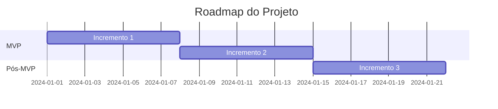

# PRD - [Nome do Projeto]

**Versão**: 0.1
**Última Atualização**: [YYYY-MM-DD]
**Status**: Rascunho - Documento Vivo

---

## 📊 FASE 1: DESCOBERTA

### Problema
[Descrever problema que o projeto resolve]

### Objetivos
- [ ] Objetivo 1
- [ ] Objetivo 2
- [ ] Objetivo 3

### KPIs (Key Performance Indicators)
- **KPI 1**: [descrição]
- **KPI 2**: [descrição]

---

## 📋 FASE 2: PLANEJAMENTO (v1.0+)

### Product Vision
[Visão do produto]

### Épicos
1. **Épico 1**: [descrição]
2. **Épico 2**: [descrição]

### MVP (Minimum Viable Product)
**Definição do MVP**:
- [ ] Feature essencial 1
- [ ] Feature essencial 2
- [ ] Feature essencial 3

**Fora do MVP** (YAGNI):
- ❌ Feature prematura 1
- ❌ Feature prematura 2

### Configurações de Desenvolvimento

#### Formato de Spikes de Validação Técnica
**Preferência**: [notebooks (.ipynb) / scripts (.py) / não-definido]

**Quando usar Notebooks**:
- Exploração de tecnologias novas
- Prototipagem interativa
- Validação de hipóteses técnicas
- Necessidade de visualizações
- Documentação de aprendizados inline

**Quando usar Scripts**:
- Spikes muito simples (< 50 linhas)
- Ambiente sem suporte a Jupyter
- Integração com CI/CD necessária
- Preferência do time

**Localização de Spikes**: `spikes/` ou `docs/spikes/`

### Roadmap

### User Stories
1. **Como** [usuário], **quero** [funcionalidade], **para** [benefício]
   - **Acceptance Criteria**:
     - [ ] Critério 1
     - [ ] Critério 2

---

## 🎨 FASE 3: DESIGN (v1.1+)

### Arquitetura de Alto Nível
[Diagrama ou descrição da arquitetura]

### Stack Tecnológica
- **Backend**: [tecnologias]
- **Frontend**: [tecnologias]
- **Banco de Dados**: [tecnologias]
- **Infraestrutura**: [tecnologias]

### Modelagem de Dados
[Schemas, entidades, relacionamentos]

### APIs / Contratos
[Definição de endpoints, contratos]

### ADRs (Architectural Decision Records)

#### ADR-001: [Título da Decisão]
- **Data**: YYYY-MM-DD
- **Status**: Aceito
- **Contexto**: [Por que essa decisão foi necessária]
- **Decisão**: [O que foi decidido]
- **Consequências**: [Impactos positivos e negativos]

---

## 💻 DESENVOLVIMENTO

### Incrementos Implementados

#### Incremento 1: [Nome]
- **Data**: YYYY-MM-DD
- **Funcionalidades**:
  - ✅ Feature 1
  - ✅ Feature 2
- **Aprendizados**: [Lições aprendidas]

---

## ✅ VALIDAÇÃO

### Testes
- [ ] Testes unitários
- [ ] Testes de integração
- [ ] Testes de performance

### Acceptance Criteria
[Status dos critérios de aceitação das user stories]

### Métricas Reais
[Métricas coletadas em produção]

---

## 🚀 DEPLOY

### Ambiente
- **Desenvolvimento**: [URL/config]
- **Homologação**: [URL/config]
- **Produção**: [URL/config]

### Pipeline CI/CD
[Descrição do pipeline]

### Monitoramento
[Ferramentas e dashboards]

---

## 📝 LIÇÕES APRENDIDAS

### Retrospectiva - Incremento 1
**Data**: YYYY-MM-DD
- **O que funcionou**:
- **O que não funcionou**:
- **Melhorias para próximo incremento**:

---

## 📊 HISTÓRICO DE VERSÕES

| Versão | Data | Mudanças |
|--------|------|----------|
| 0.1 | YYYY-MM-DD | Versão inicial - Descoberta |
| 1.0 | YYYY-MM-DD | Planejamento completo |
| 1.1 | YYYY-MM-DD | Design técnico |
| 1.x | YYYY-MM-DD | Incrementos e aprendizados |
| 2.0 | YYYY-MM-DD | Documento final (as-built) |